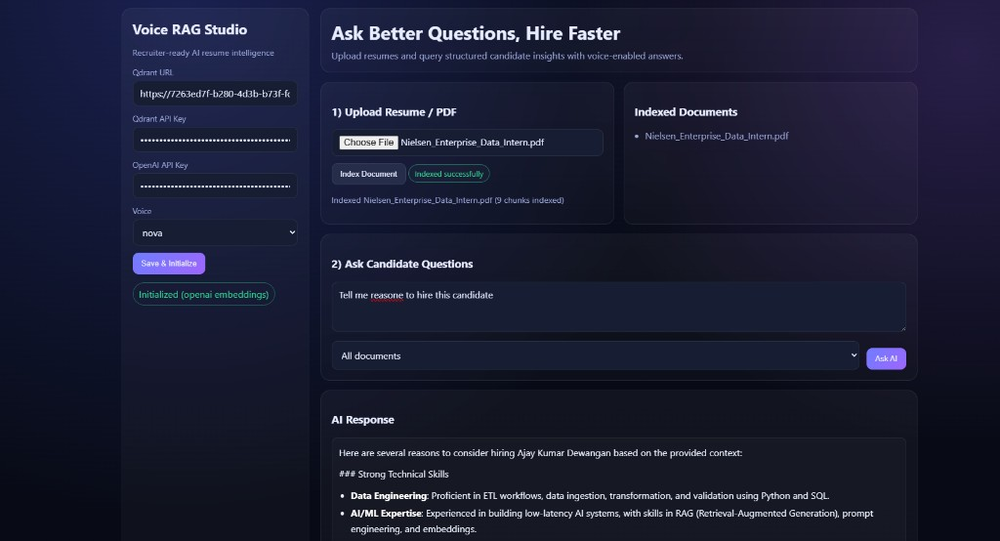
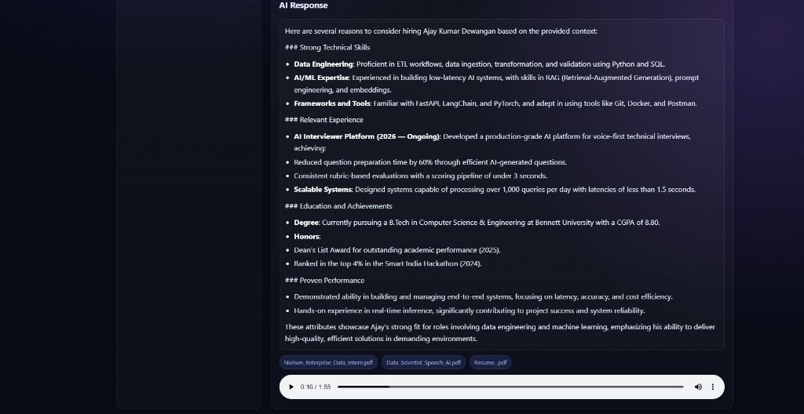
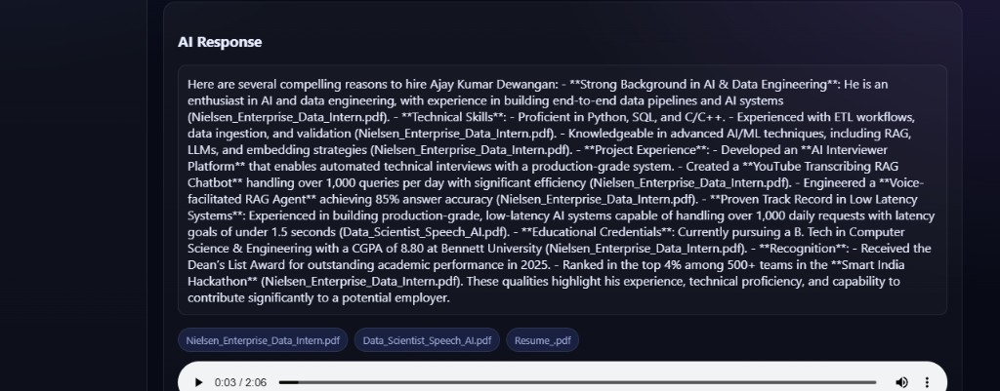
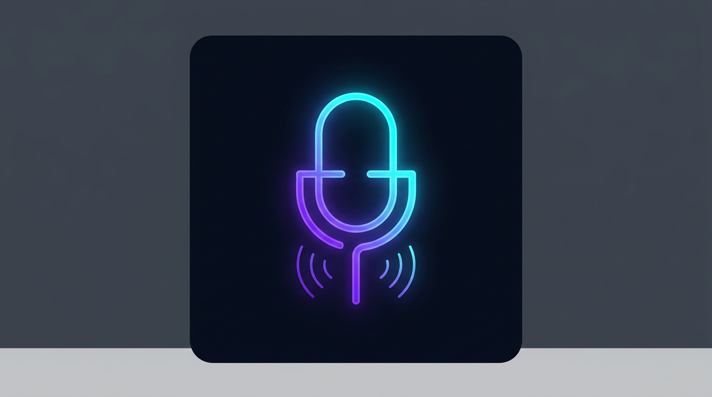

<div align="center">

# 🎙️ Voice RAG Studio

### AI-Powered Resume Intelligence — Voice + Text, Production-Grade

> Ask any question about uploaded PDF documents.  
> Get structured answers in text **and** natural voice — instantly.

[](https://python.org)
[](https://fastapi.tiangolo.com)
[](https://openai.com)
[](https://qdrant.tech)
[](https://langchain.com)
[](https://voice-rag-studio.vercel.app)

</div>

---

## 📸 Live Demo Screenshots

### Main Interface — Upload & Query


### Structured AI Response + Voice Playback


### Full Structured Response Panel


### Browser Tab Logo (Favicon)


---

## 🧠 What Is This?

**Voice RAG Studio** is a full-stack production-grade AI application that lets recruiters, engineers, and analysts upload any PDF document (resume, JD, report) and ask natural-language questions — receiving precise, structured answers in both **text** and **synthesized voice**.

Built using **Retrieval-Augmented Generation (RAG)**: documents are chunked, embedded into a semantic vector space, and retrieved at query time to ground GPT-4o-mini responses in real document context — no hallucinations, no guessing.

---

## ✨ Key Features

| Feature | Details |
|---|---|
| **Semantic Search** | Cosine-similarity vector retrieval across embedded document chunks |
| **Dual-Granularity Chunking** | Full-page + fine-grained chunks ensure names, headers, and facts are never lost |
| **Adaptive Embeddings** | FastEmbed (local) → OpenAI `text-embedding-3-small` (cloud fallback) |
| **AI Answer Generation** | GPT-4o-mini with a strict RAG extractor prompt — grounded, never hallucinated |
| **Voice Synthesis** | OpenAI `gpt-4o-mini-tts` MP3 output with 11 selectable voices |
| **Modern Web UI** | HTML/CSS/JS frontend with structured response rendering, upload status, source tags |
| **Branded Browser Tab** | Custom SVG + PNG favicon shown in browser tab and mobile touch icon |
| **REST API Backend** | FastAPI with async endpoints for config, upload, query, and audio |
| **File-Scoped Search** | Query a specific document for precise, single-resume extraction |
| **Batch Vector Upsert** | 64-point batched upsert for 10x faster PDF indexing |
| **Auto Dimension Sync** | Detects and recreates Qdrant collection when embedding dimension changes |

---

## 🏗️ System Architecture

```
┌─────────────────────────────────────────────────────────────────┐
│                      Browser (HTML/CSS/JS)                      │
│         Upload → Config → Query → Response + Audio              │
└────────────────────────┬────────────────────────────────────────┘
                         │ HTTP (REST)
┌────────────────────────▼────────────────────────────────────────┐
│                    FastAPI API Server                           │
│   POST /api/config    POST /api/upload    POST /api/query       │
│   GET  /api/status    GET  /api/audio                           │
└──────┬──────────────────┬──────────────────────┬───────────────┘
       │                  │                      │
┌──────▼──────┐  ┌────────▼────────┐  ┌─────────▼──────────────┐
│PDF Processor│  │  Vector Store   │  │    Query Processor      │
│             │  │                 │  │                         │
│ PyPDF load  │  │ AdaptiveEmbed   │  │ 1. Embed query          │
│ Full-page   │  │ FastEmbed /     │  │ 2. Qdrant search (3     │
│   chunks    │  │ OpenAI fallback │  │    fallback tiers)      │
│ Fine chunks │  │ Batch upsert    │  │ 3. GPT-4o-mini answer   │
│ Metadata    │  │ Payload index   │  │ 4. TTS → MP3 output     │
└─────────────┘  └────────┬────────┘  └─────────────────────────┘
                          │
                ┌─────────▼─────────┐
                │    Qdrant Cloud   │
                │  Vector Database  │
                │  (Cosine / 1536d) │
                └───────────────────┘
```

---

## 📁 Project Structure

```
Voice-RAG/
│
├── api/
│   └── index.py              # Vercel serverless entrypoint
│
├── api_server.py              # FastAPI REST backend
├── vercel.json                # Vercel routing/build configuration
├── render.yaml                # Render deployment configuration
├── railway.toml               # Railway deployment configuration
├── Procfile                   # Proc runner config
├── .vercelignore              # Ignore large/unneeded files for Vercel
│
├── web/                       # Modern HTML/CSS/JS frontend
│   ├── index.html             # App shell
│   ├── styles.css             # Dark-theme design system
│   ├── app.js                 # Fetch API client + UI logic
│   ├── favicon.svg            # Browser tab icon (SVG)
│   └── favicon.png            # Browser tab icon fallback (PNG)
│
├── services/
│   ├── pdf_processor.py       # Dual-granularity chunker (full-page + fine)
│   ├── vector_store.py        # AdaptiveEmbedder + Qdrant ops + auto dim-sync
│   └── query_processor.py    # Retrieval → LLM answer → TTS (3-tier fallbacks)
│
├── agent_config/
│   └── agent_setup.py         # GPT-4o-mini RAG extractor agent
│
├── config/
│   └── settings.py            # Chunk size, search limits, voices, thresholds
│
├── docs/
│   └── screenshots/           # UI screenshots for README
│
├── requirements.txt
└── .env                       # API keys (not committed)
```

---

## ⚙️ RAG Pipeline — Step by Step

```
PDF Upload
    │
    ▼
┌─────────────────────────────────────────┐
│  1.  Extract full pages via PyPDF       │
│  2.  Store one doc per page (full-page) │
│  3.  Recursively split to 500-char fine │
│      chunks with 100-char overlap       │
│  4.  Embed ALL chunks in one batch      │
│  5.  Upsert to Qdrant (64/batch)        │
│  6.  Create `file_name` keyword index   │
└─────────────────────────────────────────┘
    │
    ▼
User Query
    │
    ▼
┌─────────────────────────────────────────┐
│  1.  Embed query (same backend)         │
│  2.  Retrieve top-8 chunks (≥0.35)      │
│  3.  Fallback 1: remove threshold       │
│  4.  Fallback 2: global search          │
│  5.  Fallback 3: direct header scroll   │
│      (name detection via heuristic)     │
│  6.  Build numbered context block       │
│  7.  GPT-4o-mini answers with           │
│      strict grounding prompt            │
│  8.  OpenAI TTS → MP3                   │
└─────────────────────────────────────────┘
    │
    ▼
Structured Text + Voice Response in Browser
```

---

## 🚀 Quick Start

### Prerequisites

- Python **3.11+**
- [Qdrant Cloud account](https://cloud.qdrant.io) (free tier works)
- [OpenAI API key](https://platform.openai.com/api-keys) with GPT-4o-mini + TTS access

### 1. Clone & Install

```bash
git clone https://github.com/your-username/Voice-RAG.git
cd Voice-RAG

python -m venv .venv
# Windows
.venv\Scripts\activate
# macOS/Linux
source .venv/bin/activate

pip install -r requirements.txt
```

### 2. Configure Environment

Create a `.env` file in project root:

```env
QDRANT_URL=https://xxxx.qdrant.io
QDRANT_API_KEY=your_qdrant_api_key
OPENAI_API_KEY=sk-proj-...
```

### 3. Run the Web App

```bash
uvicorn api_server:app --host 0.0.0.0 --port 8000
```

Open [http://localhost:8000](http://localhost:8000) in your browser.

---

## 🎮 Usage Guide

| Step | Action |
|---|---|
| **1. Configure** | Enter Qdrant URL, API Key, OpenAI Key → click **Save & Initialize** |
| **2. Upload** | Select a PDF resume or document → click **Index Document** |
| **3. Watch** | Status chip shows: `Uploading…` → `Indexing…` → `Indexed successfully` |
| **4. Query** | Type any question → select scope (one doc or all) → **Ask AI** |
| **5. Read** | Structured answer with headers, bullets, bold highlights |
| **6. Listen** | AI-generated voice response plays inline, downloadable as MP3 |

---

## 🛠️ Technology Stack

| Layer | Technology | Purpose |
|---|---|---|
| Frontend | HTML5, CSS3 (custom design system), Vanilla JS | Modern recruiter-facing UI |
| API | FastAPI (async) | REST endpoints, file handling |
| LLM | OpenAI GPT-4o-mini | Grounded answer generation |
| TTS | OpenAI gpt-4o-mini-tts | Voice synthesis (11 voices) |
| Embeddings | FastEmbed / OpenAI text-embedding-3-small | Semantic vector creation |
| Vector DB | Qdrant Cloud | Cosine similarity retrieval |
| PDF | LangChain PyPDFLoader + RecursiveCharacterTextSplitter | Document ingestion |
| Agent | OpenAI Agents SDK | Orchestrated LLM calls |
| Env | python-dotenv | Credential management |

---

## 🔑 API Reference

| Method | Endpoint | Description |
|---|---|---|
| `GET` | `/` | Serve web app |
| `GET` | `/api/status` | App state, voices, indexed docs |
| `POST` | `/api/config` | Save credentials + initialize backend |
| `POST` | `/api/upload` | Upload + index a PDF |
| `POST` | `/api/query` | Ask a question, returns text + audio path |
| `GET` | `/api/audio?path=` | Stream generated MP3 |

---

## 🧩 Design Decisions

**Why dual-granularity chunking?**  
Resume headers (name, contact, title) appear on the first few lines of page 1. Standard 1000-char chunking often splits them across boundaries. Storing a full-page chunk guarantees the header is always a complete, retrievable unit.

**Why 3-tier retrieval fallback?**  
Score-threshold filtering can reject valid results when document text is low-quality or sparse. Removing the threshold, then doing a global search, then scanning stored chunks directly ensures we always return something useful.

**Why `gpt-4o-mini` over `gpt-4o`?**  
For RAG extraction tasks, `gpt-4o-mini` is 5× faster and nearly identical in factual accuracy when context is pre-filtered. The latency saving is meaningful for voice response UX.

---

## 📊 Performance

| Metric | Value |
|---|---|
| PDF indexing speed | ~9 chunks / second (OpenAI embeddings) |
| Query-to-text latency | ~2–4 seconds |
| Query-to-voice latency | ~4–7 seconds |
| Retrieval recall | 3-tier fallback — near 100% on indexed docs |
| Supported voices | 11 (alloy, ash, ballad, coral, echo, fable, onyx, nova, sage, shimmer, verse) |
| Max file size | 200 MB per PDF |

---

## 🔐 Environment Variables

| Variable | Required | Description |
|---|---|---|
| `QDRANT_URL` | Yes | Qdrant cluster endpoint |
| `QDRANT_API_KEY` | Yes | Qdrant authentication key |
| `OPENAI_API_KEY` | Yes | OpenAI API key (GPT-4o-mini + TTS) |

---

## 🚢 Deployment

The app is a single FastAPI process — no external database required (Qdrant is cloud-hosted). Any platform that can run a Python web server works.

### ✅ Current Live Deployment

- Production: [https://voice-rag-studio.vercel.app](https://voice-rag-studio.vercel.app)
- Vercel Inspect: [Project Dashboard](https://vercel.com/ai-interviewers-projects/voice-rag-studio)

---

### Option 1 — Vercel (Fastest to go live)

[](https://vercel.com/new)

1. Push this repo to GitHub
2. Go to [vercel.com](https://vercel.com) → **Add New...** → **Project**
3. Import your GitHub repo
4. Framework preset: **Other**
5. Vercel auto-detects `vercel.json` and deploys `api/index.py`
6. Add these environment variables in Vercel Project Settings:

| Variable | Value |
|---|---|
| `QDRANT_URL` | Your Qdrant cluster URL |
| `QDRANT_API_KEY` | Your Qdrant API key |
| `OPENAI_API_KEY` | Your OpenAI API key |

7. Click **Deploy**
8. Open your live URL: `https://your-project-name.vercel.app`

**Vercel-specific notes**
- Serverless function entry: `api/index.py`
- Config file used: `vercel.json`
- Static UI folder bundled via: `"includeFiles": "web/**"`
- Upload size kept small via: `.vercelignore`

---

### Option 2 — Render.com (Recommended, Free Tier)

[](https://render.com/deploy)

1. Push this repo to GitHub
2. Go to [render.com](https://render.com) → **New** → **Web Service**
3. Connect your GitHub repo
4. Render auto-detects `render.yaml` — click **Deploy**
5. Add environment variables in the Render dashboard:

| Variable | Value |
|---|---|
| `QDRANT_URL` | Your Qdrant cluster URL |
| `QDRANT_API_KEY` | Your Qdrant API key |
| `OPENAI_API_KEY` | Your OpenAI API key |

6. App will be live at `https://voice-rag-studio.onrender.com`

---

### Option 3 — Railway.app

[](https://railway.com/template)

1. Push to GitHub
2. Go to [railway.app](https://railway.app) → **New Project** → **Deploy from GitHub**
3. Select your repo — Railway picks up `railway.toml` automatically
4. Add environment variables in the Railway dashboard (same 3 keys as above)
5. Railway assigns a public URL instantly

---

### Option 4 — Local (Development)

```bash
uvicorn api_server:app --host 0.0.0.0 --port 8000 --reload
```

---

### Important Notes for All Deployments

> **In-memory state**: Uploaded file names are stored in RAM. After a restart, re-upload your PDFs — vectors remain in Qdrant Cloud permanently.

> **Credentials**: Never commit `.env` to git. Use the platform's environment variable dashboard.

> **Cold starts**: Free Render/Railway tiers sleep after inactivity. Vercel serverless may also cold-start and has function execution limits; for heavy PDFs, use paid plans for always-on workloads.

---

## 🤝 Contributing

Pull requests are welcome. For major changes, open an issue first.

1. Fork the repository
2. Create your feature branch: `git checkout -b feature/your-feature`
3. Commit changes: `git commit -m "feat: your feature"`
4. Push: `git push origin feature/your-feature`
5. Open a Pull Request

---

## 📄 License

MIT License — free to use, modify, and distribute.

---

<div align="center">

**Built with precision by [Ajay Kumar Dewangan](https://github.com/your-username)**

*AI Engineer · Full-Stack Developer · RAG Specialist*

⭐ Star this repo if you found it useful — it helps others discover the project.

</div>
